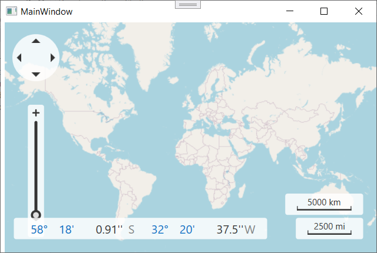

<!-- default badges list -->

<!-- default badges end -->

# Map for WPF - How to Implement a Custom Map Data Provider

This example implements a custom map data provider class inherited from the [MapDataProviderBase](http://documentation.devexpress.com/#DevExpressMapControl/clsDevExpressXpfMapMapDataProviderBasetopic) type. In the example, a custom [MapTileSourceBase](http://documentation.devexpress.com/#DevExpressMapControl/clsDevExpressXpfMapMapTileSourceBasetopic) class is implemented to supply tile URLs from the OpenStreetMap source.

## Files to Review
* [MainWindow.xaml](./CS/MainWindow.xaml) (VB: [MainWindow.xaml](./VB/MainWindow.xaml))
* [MainWindow.xaml.cs](./CS/MainWindow.xaml.cs) (VB: [MainWindow.xaml.vb](./VB/MainWindow.xaml.vb))

<!-- feedback -->
## Does This Example Address Your Development Requirements/Objectives?

 

(you will be redirected to DevExpress.com to submit your response)
<!-- feedback end -->
